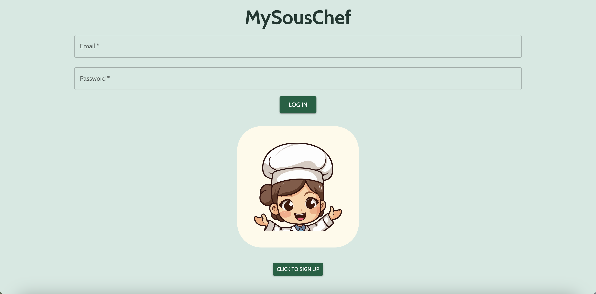
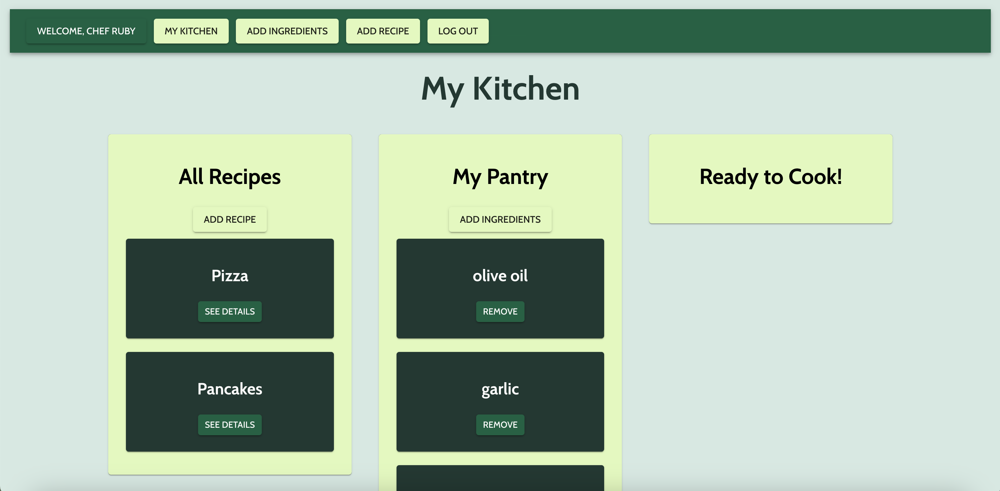
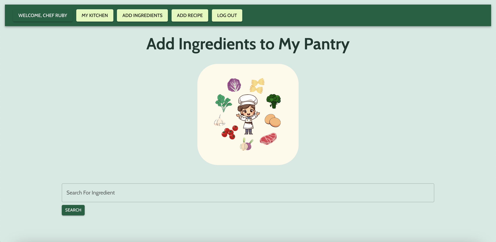
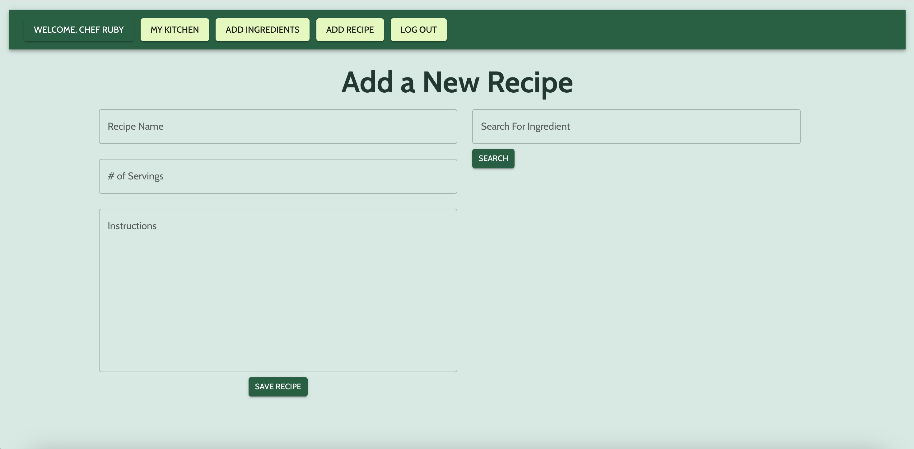
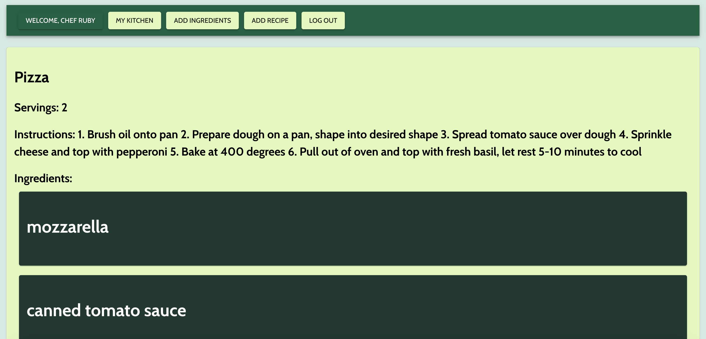

# MySousChef

## App Description
MySousChef is your digital kitchen companion, designed to simplify meal planning and cooking. This intuitive app allows you to inventory your pantry items and effortlessly discover recipes you can create with ingredients you already have. Featuring a user-friendly dashboard named "My Kitchen," MySousChef showcases a wide array of recipes added by a community of cooking enthusiasts, including you! Explore your "Pantry" to keep track of your ingredients and utilize the recipe ingredient matcher to find recipes tailored to your available supplies. Whether you're a beginner or an experienced cook, MySousChef transforms your cooking experience by ensuring you make the most out of your kitchen pantry.

## App Screenshots
Auth Page:

My Kitchen Page:

Add Ingredients Page:

Add Recipe Page:

Recipe Card:

## Technologies Used
- JavaScript
- HTML
- CSS
- Material UI
- RapidAPI
- MongoDB/Mongoose
- Express
- React
- Node

## Getting Started
Link to App: 

Trello Board: https://trello.com/b/4zstiktR/mysouschef-project-4

## Next Steps
Planned future enhancements include enabling the user to edit their own recipes, save or "favorite" other users' recipes, and filter the "All Recipes" list to only show the recipes that they added to the website.
